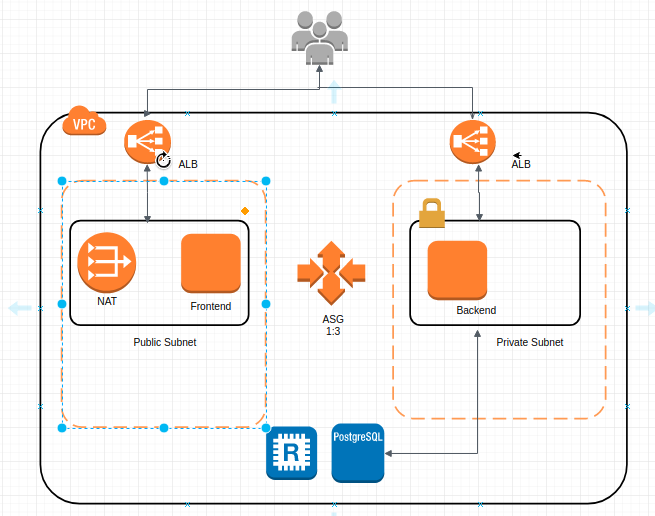

## BENO PRODUCTION SETUP 

###### 1. ABOUT 

###### 2. PROD INFRASTRUCTURE OVERVIEW




###### 3. SERVER DEPENDENCY

  > Frontend Server Dependency

  - NodeJS Installation & Version Check

```
   Step 1. Install Curl and add Install the nodejs LTS repos

       $ sudo apt install curl
       $ curl -sL https://deb.nodesource.com/setup_8.x | sudo -E bash -
             
   Step 2. Install the nodejs and npm . The npm package comes with nodeJs

       $ sudo apt install nodejs 
		
   Step 3. Version Check
		
       $ nodejs -v 
       $ npm -v
  
```

  - Nginx Installation 

```
       $ sudo apt install nginx

```	
  
  - Git Installation 

```
       $ sudo apt install git

```
  - Postgresql Installation 

```
       $ sudo add-apt-repository "deb http://apt.postgresql.org/pub/repos/apt/ xenial-pgdg main"
       $ wget --quiet -O - https://www.postgresql.org/media/keys/ACCC4CF8.asc | sudo apt-key add -
       $ sudo apt-get update
       $ sudo apt-get install postgresql-9.6

``` 

  > Backend Server Dependency

  - NodeJS Installation & Version Check

```
   Step 1. Install Curl and add Install the nodejs LTS repos

       $ sudo apt install curl
       $ curl -sL https://deb.nodesource.com/setup_8.x | sudo -E bash -
             
   Step 2. Install the nodejs and npm . The npm package comes with nodeJs

       $ sudo apt install nodejs 
		
   Step 3. Version Check
		
       $ nodejs -v 
       $ npm -v
  
```

  - Nginx Installation 

```
       $ sudo apt install nginx

```	
  
  - Git Installation 

```
       $ sudo apt install git

```
  - Postgresql Installation 

```
       $ sudo add-apt-repository "deb http://apt.postgresql.org/pub/repos/apt/ xenial-pgdg main"
       $ wget --quiet -O - https://www.postgresql.org/media/keys/ACCC4CF8.asc | sudo apt-key add -
       $ sudo apt-get update
       $ sudo apt-get install postgresql-9.6

``` 


###### 4. DEPLOYMENT 

    
  > Frontend Deployment

	 
 

      - CodeCommit
	
	1. Create the Repository in CodeCommit . 
	2. 
	

      - CodeBuild 
 
	1. Create the Build Project 
 	2. Add Source Provider and Repository


    


  > Backend Deployment

###### 5. AWS EC2 Instance 

- Frontend Server

| Name              |      Value    |  
|-------------------|:-------------:|
| Ubuntu            |  18.04        |
| AWS Instance type |  t3.micro     |   
| CPU               |  2 core       |   
| RAM               |  1 GB         |
| Region            |  Mumbai       |
| Storage           |  30 GB        |


- Backend Server

| Name              |      Value    |  
|-------------------|:-------------:|
| Ubuntu            |  18.04        |
| AWS Instance type |  t3.medium    |   
| CPU               |  2 core       |   
| RAM               |  4 GB         |
| Region            |  Mumbai       |
| Storage           |  30 GB        |


- RDS Database

| Name              |      Value    |  
|-------------------|:-------------:|
| DB Engine         | PostgreSQL 10 |
| AWS Instance type | t3.medium     | 
| RAM               | 4 GB          |   
| Storage           | 20GB          |
| Region            | Mumbai        |

- REDIS In-Memory

| Name              |      Value    |  
|-------------------|:-------------:|
| Cache Engine      | Redis         |
| AWS Instance type | t2.medium     |  
| RAM               | 4 GB          |  
| Storage           | 20GB          |
| Region            | Mumbai        |

###### 6. LOGIN CREDDENTIALS
 
- AWS Console 

  URL      : https://console.aws.amazon.com/		
  Username : developer@beno.com		
  Password : @Just4beno

- SSH Access for Frontend Server


   **$ ssh -i   beno-prod.pem  ubuntu@13.232.248.32**

- SSH Access for Backend Server 
  
   Firstly SSH into Frontend Server then login into backend server as Backend is in Private Subnet 
 
   **$ ssh -i   beno-prod.pem  ubuntu@13.232.248.32**

   **$ ssh -i   beno-prod.pem  ubuntu@10.0.21.52**
  
