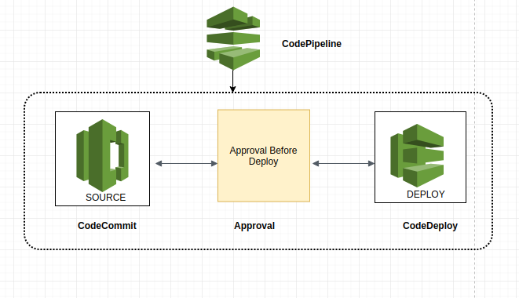

## BENO PRODUCTION SETUP 

###### 1. ABOUT 

###### 2. PROD INFRASTRUCTURE OVERVIEW


 **Description**

 * Application Load Balancer : The load balancer distributes incoming application traffic across multiple targets. Here two ALB has been used 
   for both the server seperately. This increases the availability of your application.

   ALB Frontend Endpoint - Prod-Frontend-ALB-2053540867.ap-south-1.elb.amazonaws.com
   Listeners             
   
   80  ---> 443
   443 ---> Prod-Frontend-target i.e Frontend-Server
 
   ALB Backend Endpoint - Prod-Backend-ALB-344259781.ap-south-1.elb.amazonaws.com
   Listeners             
   
   80  ---> 443
   443 ---> Prod-Backend-target i.e Backend-Server
                                
 * Auto Scaling Group :

   > ASG For Frontend

	   Launch Configuration Details :
	  
	   Instance Attached - prod-frontend-asg-alb-LaunchConfig-1REIKV7BLFOFGCopy (Frontend Server)
	   Desired Capacity  - 1
	   Min               - 1
	   Max               - 3
	   Availability Zone - ap-south-1b, ap-south-1a
	  
	   
	   Scaling Policies

	 ```
	   Scale Out Policy 

	    If CPUUtilization > 70 for 300 seconds 
	    Add	1 instance	

	   Scale In Policy

	    If CPUUtilization < 40 for 300 seconds 
	    Remove 1 Instance
	 ```
	 
   > ASG For Backend

	  Launch Configuration Details :
	  
	  Instance Attached - prod-backend-asg-alb-LaunchConfig-1G3SSFR57KX1U-newCopy (Backend Server)
	  Desired Capacity  - 1
	  Min               - 1
	  Max               - 3
	  Availability Zone - ap-south-1a
	  Scaling Policies

	 ```
	  Scale Out Policy 

	   If CPUUtilization > 70 for 300 seconds 
	   Add	1 instance	

	  Scale In Policy

	   If CPUUtilization < 40 for 300 seconds 
	   Remove 1 Instance
	 ```

  * NAT Gateway : Network address translation (NAT) gateway to enable instances in a private subnet to connect to the internet or other AWS 			  services, but prevent the internet from initiating a connection with those instances. So The Backend Server will connect with 
                  Internet via NAT Gateway.
  
###### 3. SERVER PRE-REQUISITE

  > Frontend Server Pre-Requisite

  - NodeJS Installation & Version Check

```
   Step 1. Install Curl and add Install the nodejs LTS repos

       $ sudo apt install curl
       $ curl -sL https://deb.nodesource.com/setup_8.x | sudo -E bash -
             
   Step 2. Install the nodejs and npm . The npm package comes with nodeJs

       $ sudo apt install nodejs 
		
   Step 3. Version Check
		
       $ nodejs -v 
       $ npm -v
  
```

  - Nginx Installation 

```
       $ sudo apt install nginx
```	
  
  - Git Installation 

```
       $ sudo apt install git
```
  - Postgresql Installation 

```
       $ sudo add-apt-repository "deb http://apt.postgresql.org/pub/repos/apt/ xenial-pgdg main"
       $ wget --quiet -O - https://www.postgresql.org/media/keys/ACCC4CF8.asc | sudo apt-key add -
       $ sudo apt-get update
       $ sudo apt-get install postgresql-9.6

``` 

  > Backend Server Pre-Requisite

  - NodeJS Installation & Version Check

```
   Step 1. Install Curl and add Install the nodejs LTS repos

       $ sudo apt install curl
       $ curl -sL https://deb.nodesource.com/setup_8.x | sudo -E bash -
             
   Step 2. Install the nodejs and npm . The npm package comes with nodeJs

       $ sudo apt install nodejs 
		
   Step 3. Version Check
		
       $ nodejs -v 
       $ npm -v
  
```

  - Nginx Installation 

```
       $ sudo apt install nginx
```	
  
  - Git Installation 

```
       $ sudo apt install git
```
  - Postgresql Installation 

```
       $ sudo apt-get install wget ca-certificates
       $ wget --quiet -O - https://www.postgresql.org/media/keys/ACCC4CF8.asc | sudo apt-key add -
       $ sudo apt-get update
       $ sudo apt-get install postgresql-10
``` 

###### 4. DEPLOYMENT 

    
  > Frontend Deployment

	 
 

   **Flow Of Deployment**
    
   * Once your pull-request has been merged CodePipeline will run the merged result and trigger the CodeBuild.
   * CodeBuild will run the buildsepc.yml file which has been congfigured to run the build commands for nodejs application and will copy the 
     build to S3 bucket.
   
    ```
	version: 0.2

	phases:
	  install:
	    runtime-versions:
	      nodejs: 8
	  pre_build:
	    commands:
	       - npm install      
	  build:
	    commands:
	      - npm run build
	  post_build:
	    commands:
	       - cd dist
	       - aws s3 sync ./ s3://prod-deploy-frontend/deployable/ --delete --acl public-read --cache-control max-age=0
	```    
    
   * Once the codebuild is successful, the stage added to pipeline for manual approval via SNS will get executed . When it gets approved  
     for deployment then the CodeDeploy will run.

   * In the CodeDeploy , appspec.yml file is configured which will copy the build folder from s3 to Frontend Server

	```	
	version: 0.0 
	os: linux 
	files: 
	    - source: / 
	      destination: /home/ubuntu/mybackendadmin 
	hooks: 
	  BeforeInstall: 
	    #- location: scripts/common_functions.sh 
	    - location: scripts/prod_before.sh 
	      runas: root 
	 
	  AfterInstall: 
	    - location: scripts/prod_after.sh 
	      runas: root 
	```


  > Backend Deployment



   * Once your pull-request has been merged CodePipeline will run the merged result .
   * The stage added to pipeline for manual approval via SNS will get executed . When it gets approved  
     for deployment then the CodeDeploy will run.
   * In the CodeDeploy , appspec.yml file is configured with two scripts file `prod_before.sh` and `prod_after.sh` . prod_before.sh execute and 
     verify whether the app is running or not. If it is running it stops the running application. Then prod_after.sh get executed which 
     install the npm modules and runs the application and copy all the logs to s3 . (s3://prod-deploy-backend/deploy-logs)

	```
	version: 0.0 
	os: linux 
	files: 
	    - source: / 
	      destination: /home/ubuntu/mybackendadmin 
	hooks: 
	  BeforeInstall: 
	    - location: scripts/prod_before.sh 
	      runas: root 
	 
	  AfterInstall: 
	    - location: scripts/prod_after.sh 
	      runas: root 
	```


###### 5. AWS EC2 Instance 

- Frontend Server

| Name              |      Value    |  
|-------------------|:-------------:|
| Ubuntu            |  18.04        |
| AWS Instance type |  t3.micro     |   
| CPU               |  2 core       |   
| RAM               |  1 GB         |
| Region            |  Mumbai       |
| Storage           |  30 GB        |


- Backend Server

| Name              |      Value    |  
|-------------------|:-------------:|
| Ubuntu            |  18.04        |
| AWS Instance type |  t3.medium    |   
| CPU               |  2 core       |   
| RAM               |  4 GB         |
| Region            |  Mumbai       |
| Storage           |  30 GB        |


- RDS Database

| Name              |      Value    |  
|-------------------|:-------------:|
| DB Engine         | PostgreSQL 10 |
| AWS Instance type | t3.medium     | 
| RAM               | 4 GB          |   
| Storage           | 20GB          |
| Region            | Mumbai        |

- REDIS In-Memory

| Name              |      Value    |  
|-------------------|:-------------:|
| Cache Engine      | Redis         |
| AWS Instance type | t2.medium     |  
| RAM               | 4 GB          |  
| Storage           | 20GB          |
| Region            | Mumbai        |

###### 6. LOGIN CREDDENTIALS
 
- SSH Access for Frontend Server


     **$ ssh -i   filename.pem  ubuntu@13.232.248.32**

- SSH Access for Backend Server 
  
   Firstly SSH into Frontend Server then login into backend server as Backend is in Private Subnet 
 
     **$ ssh -i   filename.pem  ubuntu@13.232.248.32**

     **$ ssh -i   filename.pem  ubuntu@10.0.21.52**
  
###### 7. BACKUP POLICY


